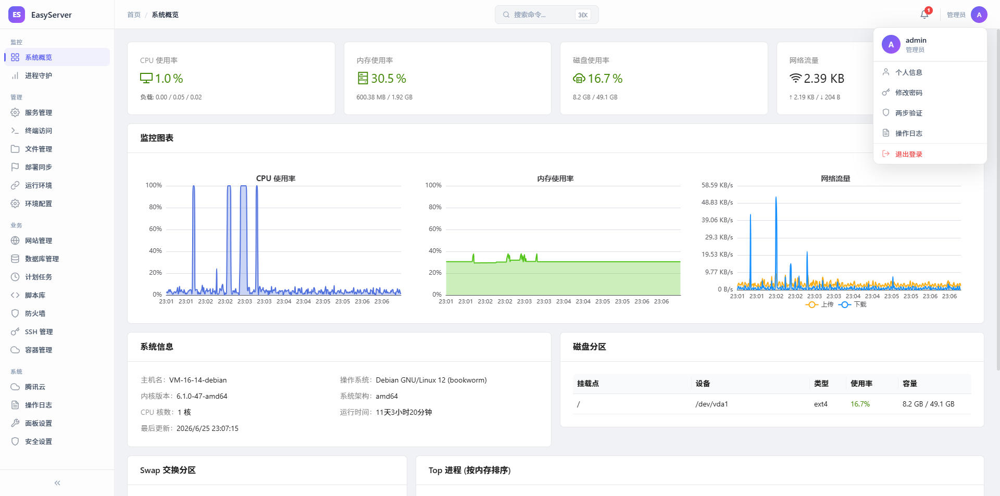

# EasyServer

**All-in-One Linux Server Management Panel** — Built with Go + React, lightweight, secure, and feature-rich.

[中文](README.md) · [Documentation Site](https://lmy8848.github.io/easyserver/) · [API Reference](docs/api-reference.md) · [Deployment Guide](docs/linux-deploy.md)



---

## Features

- **System Monitoring** — Real-time CPU / memory / disk / network monitoring with historical charts
- **Process Management** — systemd service management, process supervision and auto-restart
- **Web Terminal** — Browser-based terminal with PTY-powered real shell
- **File Management** — Online browse / edit / upload / download / compress / extract
- **Web Server** — Nginx / Apache installation, configuration, and site management
- **Database** — Multi-version management for MySQL / PostgreSQL / Redis
- **Container Management** — Docker / Compose / images / volumes / networks
- **Firewall** — iptables / nftables rule management
- **Runtime Environment** — Node.js / Python / Go / Java runtime management (via mise)
- **Scheduled Tasks** — Cron job management with support for scripts and documents
- **Remote Deployment** — SSH remote server management, one-click deployment
- **Notifications & Alerts** — Webhook notifications (DingTalk / Feishu / WeCom) + alert rules
- **Audit Logs** — Complete operation audit with export and integrity verification
- **2FA Authentication** — TOTP two-factor authentication with backup codes
- **QR Login** — Scan-to-login from mobile device
- **Security Scan** — CVE vulnerability scanning (osv.dev query + one-click upgrade)
- **File Sharing** — Secure file share links with password / expiry control
- **Port Monitor** — Real-time listening port viewer

---

## Quick Start

### Docker Deployment (Recommended)

```bash
docker run -d \
  --name easyserver \
  -p 8080:8080 \
  -v /opt/easyserver/data:/app/data \
  -e EASYSERVER_JWT_SECRET="$(openssl rand -base64 32)" \
  -e EASYSERVER_ENCRYPTION_KEY="$(openssl rand -base64 32)" \
  lmy8848/easyserver:latest
```

Access `http://your-server:8080`. The admin password is displayed on the console on first start.

### Binary Deployment

```bash
# Download the latest release
wget https://github.com/lmy8848/easyserver/releases/latest/download/easyserver-linux-amd64
chmod +x easyserver-linux-amd64

# Generate config
cat > config.yaml << 'EOF'
server:
  port: 8080
  host: 0.0.0.0
  serve_frontend: true
auth:
  jwt_secret: "your-random-secret-32-bytes!!"
database:
  path: "./data/easyserver.db"
filemanager:
  base_path: "/opt/easyserver/data"
EOF

# Start
./easyserver-linux-amd64 -config config.yaml
```

---

## Tech Stack

| Layer    | Technology |
|----------|------------|
| Backend  | Go 1.25 + Gin + SQLite (WAL) + WebSocket + JWT |
| Frontend | React 19 + TypeScript + Ant Design 6 + Vite 8 |
| Deploy   | Docker multi-stage build + systemd |

---

## Documentation

| Document | Description |
|----------|-------------|
| [Documentation Site](https://lmy8848.github.io/easyserver/) | Complete usage documentation |
| [API Reference](docs/api-reference.md) | Full API documentation |
| [Linux Deployment Guide](docs/linux-deploy.md) | Binary deployment + systemd + Nginx |

---

## System Requirements

| Item | Minimum | Recommended |
|------|---------|-------------|
| OS | Linux x86_64 | Ubuntu 22.04+ / Debian 12+ |
| Memory | 512MB | 1GB+ |
| Disk | 1GB | 5GB+ |
| Port | 8080 | Configurable |

---

## Development

```bash
# Backend (development mode, requires air)
make dev

# Or manually
go build -tags dev -o easyserver ./cmd/server
./easyserver -config config.yaml -dev

# Frontend (hot reload)
cd web
pnpm install
pnpm dev
# Visit http://localhost:5173
```

---

## Security Recommendations

1. **Must change** `jwt_secret` and `encryption_key` — use `openssl rand -base64 32` to generate
2. **Enable HTTPS** in production (via Nginx reverse proxy or direct TLS config)
3. **Configure IP whitelist** to restrict management panel access
4. **Regularly back up** database and configuration files

---

## License

MIT License

## Contributing

Issues and Pull Requests are welcome!

1. Fork the repository
2. Create a feature branch (`git checkout -b feature/amazing-feature`)
3. Commit your changes (`git commit -m 'Add amazing feature'`)
4. Push the branch (`git push origin feature/amazing-feature`)
5. Submit a Pull Request
