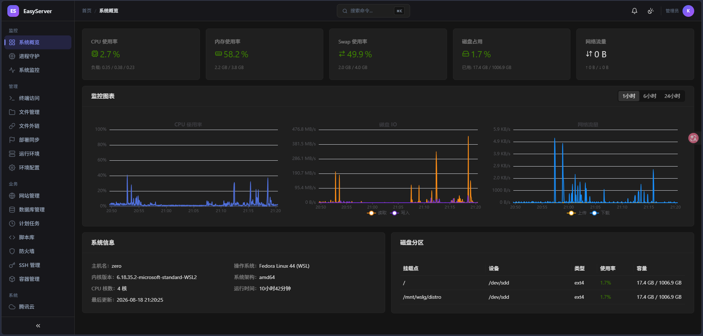

# EasyServer

**一站式 Linux 服务器管理面板** — Go + React 构建。轻量、安全、功能全面，通过浏览器管理 Linux 服务器。

[English](README.md) · [文档网站](https://lmy8848.github.io/easyserver/) · [API 文档](https://lmy8848.github.io/easyserver/api-reference) · [部署指南](https://lmy8848.github.io/easyserver/linux-deploy)




---

## 功能特性

- **系统监控** — CPU / 内存 / 磁盘 / 网络实时监控，历史图表
- **进程管理** — systemd 服务控制与进程守护、自动重启
- **Web 终端** — 浏览器终端，基于真实 PTY Shell
- **文件管理** — 在线浏览 / 编辑 / 上传 / 下载 / 压缩解压，内置编辑器
- **Web 服务器** — Nginx / Apache 安装、配置、站点管理
- **数据库** — MySQL / PostgreSQL / Redis 多版本管理，SQL 控制台与备份
- **容器管理** — Docker / Compose / 镜像 / 存储卷 / 网络
- **防火墙** — iptables / nftables 规则管理
- **运行环境** — Node.js / Python / Go / Java 运行时管理（via mise）
- **计划任务** — Cron 任务管理，脚本库支持
- **远程部署** — SSH 远程服务器管理，一键部署
- **通知告警** — Webhook 通知（钉钉 / 飞书 / 企业微信）+ 指标告警规则
- **审计日志** — 完整操作审计，支持导出与清理策略
- **全局运行日志** — 应用运行日志持续落盘应用目录，面板可配置日志等级（即时生效），错误可定位到源码位置，便于排障
- **2FA 认证** — TOTP 双因素认证，支持备用码
- **扫码登录** — 手机端扫码登录
- **安全运维** — SSH 加固向导、CVE 漏洞扫描（osv.dev）、登录异常检测与封禁、文件完整性监控（FIM）
- **文件外链** — 安全的文件分享链接，支持密码 / 过期控制
- **端口监控** — 实时监听端口查看

---

## 快速开始

### 二进制部署

```bash
# 下载最新版本
wget https://github.com/lmy8848/easyserver/releases/latest/download/easyserver-linux-amd64
chmod +x easyserver-linux-amd64

# 生成配置文件
cat > config.toml << 'EOF'
[server]
port = 8080
host = "0.0.0.0"

[filemanager]
base_path = "/opt/easyserver/data"
EOF

# 启动面板
./easyserver-linux-amd64 -config config.toml
```

管理员密码在首次启动时随机生成并打印。完整配置项见 [config.toml.example](config.toml.example)，systemd 部署见[部署指南](https://lmy8848.github.io/easyserver/linux-deploy)。

> 注意：生产环境运行时**不要加 `-dev`**（`-dev` = 仅 API、不内嵌前端）。

---

## 技术栈

| 层级 | 技术 |
|------|------|
| 后端 | Go 1.25 + Gin + SQLite (WAL) + WebSocket + JWT |
| 前端 | React 19 + TypeScript + Ant Design 6 + Vite |
| 部署 | 单二进制 + systemd |

---

## 文档

| 文档 | 说明 |
|------|------|
| [文档网站](https://lmy8848.github.io/easyserver/) | 完整使用文档 |
| [API 文档](https://lmy8848.github.io/easyserver/api-reference) | 完整接口文档 |
| [Linux 部署手册](https://lmy8848.github.io/easyserver/linux-deploy) | 二进制部署 + systemd + Nginx |
| [贡献指南](CONTRIBUTING.md) | 如何参与贡献 |

---

## 系统要求

| 项目 | 最低要求 | 推荐配置 |
|------|----------|----------|
| 操作系统 | Linux x86_64 | Ubuntu 22.04+ / Debian 12+ |
| 内存 | 512MB | 1GB+ |
| 磁盘 | 1GB | 5GB+ |
| 端口 | 8080 | 可配置 |

---

## 开发

```bash
# 后端（开发模式，air 热重载）
make dev

# 或手动启动 API（前端由 Vite 提供）
go build -tags dev -o easyserver ./cmd/server
./easyserver -config config.toml -dev

# 前端（热更新）
cd web
pnpm install
pnpm dev
# 访问 http://localhost:5173
```

完整本地开发环境搭建见 [docs/development.md](docs/development.md)。

---

## 安全建议

1. 修改 `jwt_secret` 与 `encryption_key`，用 `openssl rand -base64 32` 生成强随机值（留空会在首次启动自动生成）
2. 生产环境启用 HTTPS（Nginx 反向代理或内置 TLS 配置）
3. 配置 IP 白名单限制面板访问来源
4. 定期备份数据库与配置——数据位于 `/opt/easyserver/data`
5. 关注运行日志 `/opt/easyserver/easyserver.log` 以排查问题与安全事件

---

## 许可证

以 [MIT License](LICENSE) 发布。

## 贡献

欢迎提交 Issue 和 Pull Request！请先阅读[贡献指南](CONTRIBUTING.md)。

1. Fork 本仓库
2. 创建特性分支 (`git checkout -b feature/amazing-feature`)
3. 提交更改 (`git commit -m 'feat(x): add amazing feature'`)
4. 推送分支 (`git push origin feature/amazing-feature`)
5. 提交 Pull Request